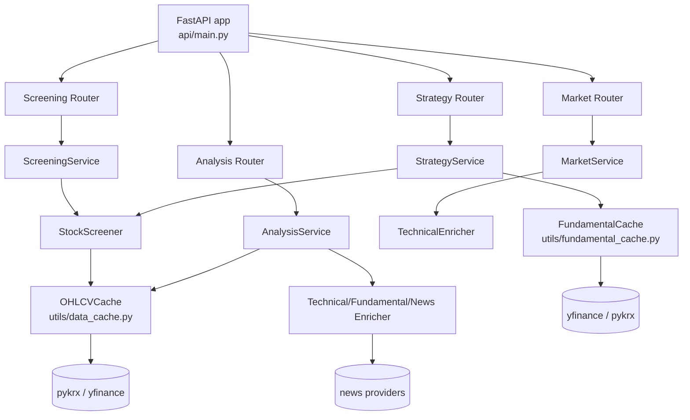
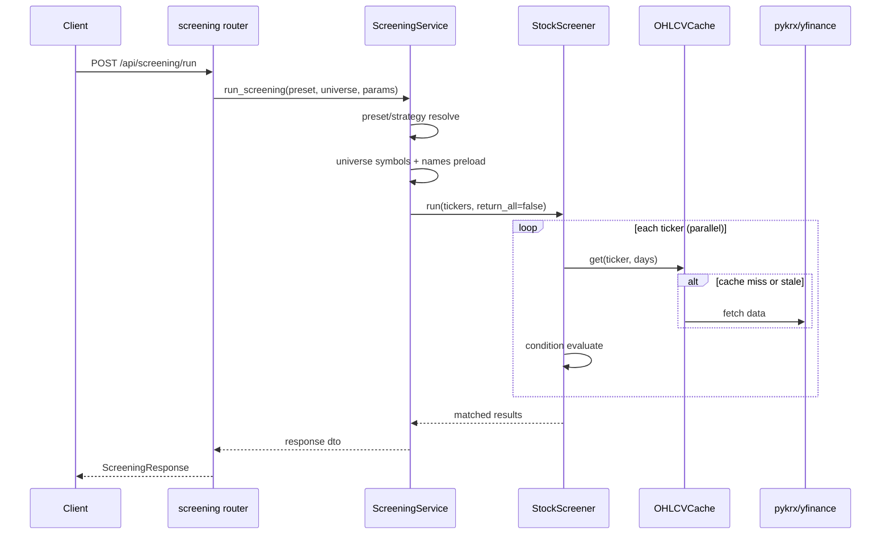
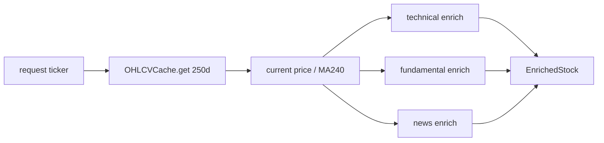

# Backend 핵심 로직 개요 (데이터 수집/스크리닝/전략 실행)

이 문서는 현재 코드 기준으로, 백엔드가 어떤 순서로 데이터를 가져오고 스크리닝/전략 실행을 처리하는지 빠르게 파악하기 위한 운영 문서입니다.

## 0) Mermaid 다이어그램

### 0-1. 전체 아키텍처 흐름



### 0-2. `/api/screening/run`



### 0-3. `/api/strategy/run` (QuantCanvas)

```mermaid
flowchart TD
    A[Strategy graph input] --> B[build_flat_conditions_from_graph]
    B --> C[leaf conditions + node meta]
    C --> D[universe tickers load]
    D --> E[optional sector pre-filter]
    E --> F[StockScreener.run(return_all=true)]
    F --> G[_compute_node_survivors]
    G --> H[output node survivors = final]
    H --> I[enrich_fundamentals]
    I --> J[StrategyExecuteResponse]
```

### 0-4. `/api/analysis/enrich`



### 0-5. `/api/market/*`

```mermaid
flowchart TD
    A[/api/market/quote/{ticker}] --> B[MarketService.get_quote]
    C[/api/market/ohlcv/{ticker}] --> D[MarketService.get_ohlcv]
    E[/api/market/technical/{ticker}] --> F[MarketService.get_technical_indicators]

    B --> G[OHLCVCache.get days=5]
    B --> H[yfinance info name lookup<br/>best-effort]
    D --> I[OHLCVCache.get days=N]
    F --> J[OHLCVCache.get days=300]
    F --> K[TechnicalEnricher.enrich]

    G --> L[(pykrx / yfinance)]
    I --> L
    J --> L

    B --> M[QuoteResponse]
    D --> N[OHLCVResponse]
    F --> O[TechnicalIndicators]
```

## 1) 전체 구조

- 앱 엔트리: `api/main.py`
- 주요 라우터
  - 스크리닝: `api/routers/screening.py`
  - 전략 빌더: `api/routers/strategy.py`
  - 분석: `api/routers/analysis.py`
  - 시세: `api/routers/market.py`
- 핵심 서비스
  - 스크리닝 서비스: `api/services/screening_service.py`
  - 전략 서비스: `api/services/strategy_service.py`
  - 분석 서비스: `api/services/analysis_service.py`
  - 시세 서비스: `api/services/market_service.py`
- 핵심 엔진/캐시
  - 스크리너 엔진: `screener/stock_screener.py`
  - OHLCV 캐시: `utils/data_cache.py`
  - 펀더멘털 영속 캐시: `utils/fundamental_cache.py`

## 2) 데이터 소스와 기본 원칙

- OHLCV
  - 한국(.KS/.KQ): `pykrx` 우선, 실패 시 `yfinance` 폴백
  - 미국: `yfinance`
- 펀더멘털
  - 한국: `pykrx`(PER/PBR/DIV)
  - 미국: `yfinance.info`
- 뉴스
  - `NewsEnricher` -> 뉴스 aggregator 사용
- 캐시 우선
  - 시계열(OHLCV): parquet 파일 캐시 (`data/cache/ohlcv`)
  - 펀더멘털/재무: JSON 캐시 (`data/cache/fundamentals`)

## 3) 요청 흐름 A: `/api/screening/run`

경로: `api/routers/screening.py` -> `ScreeningService.run_screening()`

1. preset 해석
- static preset 또는 `custom:{strategy_id}` 로드
- custom이면 저장된 전략 그래프를 조건 리스트로 변환

2. 유니버스 심볼/이름 선조회
- `ScreeningService._get_universe_symbols()` 로 `{ticker: name}` 생성
- 이 이름 매핑을 `StockScreener(stock_names=...)` 로 주입해 N+1 name 조회를 줄임

3. 스크리닝 실행
- `StockScreener.run(tickers=..., return_all=False)`
- 내부에서 `ThreadPoolExecutor` 로 종목 병렬 처리
- 각 종목마다
  - `_fetch_data()` -> `OHLCVCache.get()` (캐시 우선)
  - 조건 evaluate 반복
  - 결과 `ScreeningResult` 생성

4. 응답 변환
- 조건별 결과를 `ConditionResultItem` 으로 직렬화

## 4) 요청 흐름 B: `/api/strategy/run` (QuantCanvas)

경로: `api/routers/strategy.py` -> `execute_strategy()`

1. 그래프 파싱
- `build_flat_conditions_from_graph()`
- Output 노드 기준으로 역방향 순회
- condition/logic/universe/sector 노드 메타 생성
- 핵심: "중첩 조건 객체" 대신 "leaf condition 평탄화" + node metadata 유지

2. 대상 티커 수집
- `ScreeningService._get_universe_tickers()`
- sector 노드가 연결되어 있으면 사전 필터링

3. 실제 스크리닝
- `StockScreener(conditions=leaf_conditions, return_all=True)`
- 전체 종목에 대해 leaf 조건 결과를 보존

4. 노드별 중간 결과 계산
- `_compute_node_survivors()`
- 각 노드(operator: and/or/not)의 누적 생존 집합 계산
- 최종 Output node 생존 집합이 최종 결과

5. 최종 결과 enrichment
- `enrich_fundamentals(final_items)`
- KR/US 분리 조회 후 `per/pbr/dividend_yield` 채움
- `FundamentalCache`로 TTL 캐시 사용

### `/api/strategy/run/stream` 차이점

- 먼저 `skip_enrich=True`로 스크리닝만 실행하여 진행률 이벤트(SSE) 전달
- 마지막에 펀더멘털 enrichment를 별도로 수행
- 체감상 "100% 도달"을 빨리 보여주려는 의도

## 5) 요청 흐름 C: `/api/analysis/enrich`

경로: `api/routers/analysis.py` -> `AnalysisService.enrich_stock()`

1. OHLCV 로딩 (`cache.get(ticker, days=250)`)
2. 현재가/MA240/이격도 계산
3. 아래 3개를 병렬 실행
- technical enrichment
- fundamental enrichment
- news enrichment (옵션)
4. `EnrichedStock` 반환

즉, 분석 엔드포인트는 "단일 종목에 대한 종합 데이터 조립기" 역할입니다.

## 6) 요청 흐름 D: `/api/market/*`

경로: `api/routers/market.py` -> `MarketService`

- `/quote/{ticker}`
  - 최근 5일 OHLCV로 현재가/등락률 계산
  - 회사명은 best-effort `yfinance.info` 조회
- `/ohlcv/{ticker}`
  - OHLCV 캐시 데이터 직렬화 반환
- `/technical/{ticker}`
  - OHLCV(300일) + `TechnicalEnricher` 계산

## 7) 캐시 구조 요약

### OHLCV 캐시 (`utils/data_cache.py`)
- 저장: ticker별 parquet
- fresh 판단: 최신 거래일 기준
- stale이면 증분 업데이트(기존 parquet + 신규 데이터 병합)
- 포트폴리오 가격용 배치 조회(`get_latest_prices`) 지원

### Fundamental 캐시 (`utils/fundamental_cache.py`)
- 저장: namespace+key별 JSON envelope
- TTL 기반 만료
- `get_or_set()` + key 단위 lock으로 cold start 동시 요청(thundering herd) 완화

## 8) 조건 평가 로직 핵심

- 조건 클래스들은 `screener/conditions/*` 에 존재
- 각 조건은 `evaluate(ticker, data) -> ConditionResult`
- `StockScreener`는 종목별로 조건을 순회해 all/any/not 결과를 합성
- Strategy 모드에서는 leaf 결과를 먼저 계산하고, 그래프 노드에서 후처리로 합성

## 9) 운영 시 체크 포인트

1. 응답 지연이 길 때
- OHLCV 캐시 hit율 확인 (`OHLCVCache.status()`)
- 유니버스 크기와 `max_workers` 확인
- yfinance 호출이 name/fundamental 쪽에서 중복되는지 확인

2. 결과 수가 기대와 다를 때
- strategy graph 연결(Output reachable) 확인
- sector 노드가 실제로 output 경로에 연결되었는지 확인
- condition 파라미터 타입(coerce) 확인

3. 데이터 누락/None이 많을 때
- pykrx / yfinance 일시 장애 여부
- fundamental TTL 캐시에 실패 값이 장시간 남는지 확인

## 10) 읽는 순서 추천

백엔드 로직을 빠르게 파악하려면 아래 순서가 가장 빠릅니다.

1. `api/routers/screening.py`
2. `api/services/screening_service.py`
3. `screener/stock_screener.py`
4. `utils/data_cache.py`
5. `api/services/strategy_service.py`
6. `api/services/analysis_service.py`

---

필요하면 다음 단계로, 위 흐름을 기준으로 "실제 병목 지점(현재 #227 범위)"을 함수 단위로 더 세분화한 문서(예: 호출 횟수/예상 시간/개선안 표)까지 확장할 수 있습니다.
